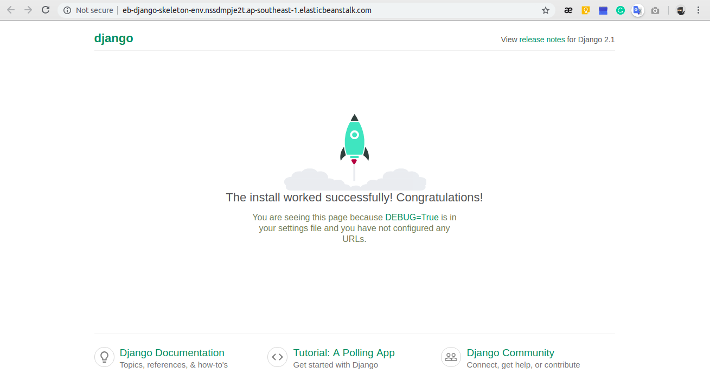

# Deploy a simple Django project to AWS Elastic Beanstalk

**Lesson Learn**

When I try to deploy a simple Django 2 project to AWS Elastic Beanstalk. I got some errors because of the AWS Elastic Beanstalk using default EC2 instance (t2.micro - Free tier in my case) with a Amazon Machine Image which support python version 2.7.

So to fix this, we will choose an new Amazon Machine Image (AMI) have support python 3. 

Don't worry. We will fix this in the last step of this tutorial.

## Tutotials

### Step 1: Create a simple Django 2 project with virtualenv

In this tutorial, we will create a project named **eb-django-skeleton**, and create a simple Django 2 project inside it.

Project Structure

```
eb-django-skeleton
|_ .ebextensions (Custom config)
|_ .elasticbeanstalk (Elastic Beanstalk init)
|_ venv
|_ requirements.txt
|_ ebdjango (Django)
	|_ manage.py
	|_ ebdjango
		|_ setting.py
		|_ wsgi.py
		...
```

Let create project structure with these command:

```
mkdir eb-django-skeleton
cd eb-django-skeleton
virtualenv env
source venv/bin/activate
django-admin startproject ebdjango
```

Run project

```
cd ebdjango
python manage.py runserver
```

Export required libraries

```
cd eb-django-skeleton
pip freeze > requirements.txt
```

### Step 2: Init and config Elastic Beanstalk.

1. Install awsebcli

    ```shell
    pip install awsebcli
    ```

2. Initial Elastic Beanstalk for project

	```shell
	eb init
	```

### Step 3. Deploy to AWS Elastic Beanstalk.

1. Create new environment for our application

```
eb create eb-django-skeleton-env
```

2. Deploy project to EB Environment

```
eb deploy
```

3. Open our project on browser

```
eb open
```


### Step 4: Add allow host for Django project

1. Open AWS Elastic Beanstalk dashboard
2. Open **eb-django-skeleton** application.
3. Open **eb-django-skeleton-env** environtment.
4. Open tab: **Configuration**
	- Find: Environment properties
	- Add properties **ALLOWED_HOSTS** with value: **.elasticbeanstalk.com**
5. Click "Apply" and wating for the environtment update.
6. Done

### Step 5: Fix error 500

This happen when your deploy instance using python 2.7. So to fix this we will choose a new Amazon Machine Image (AMI) for application.

1. Open AWS Elastic Beanstalk dashboard
2. Open **eb-django-skeleton** application.
3. Open **eb-django-skeleton-env** environtment.
4. Open tab: **Configuration**
	- Click: Intances
	- Update new AMI ID: ami-xxxxxxxxxxxxx
	([find AMI ID here](https://ap-southeast-1.console.aws.amazon.com/ec2/v2/home?region=ap-southeast-1#LaunchInstanceWizard:))

5. Click **Apply** button and wating for the environtment update.
6. Done

### Result 
[AWS Elastic Beanstalk Django Sekeleton](http://eb-django-skeleton-env.nssdmpje2t.ap-southeast-1.elasticbeanstalk.com/)



Enjoy it!